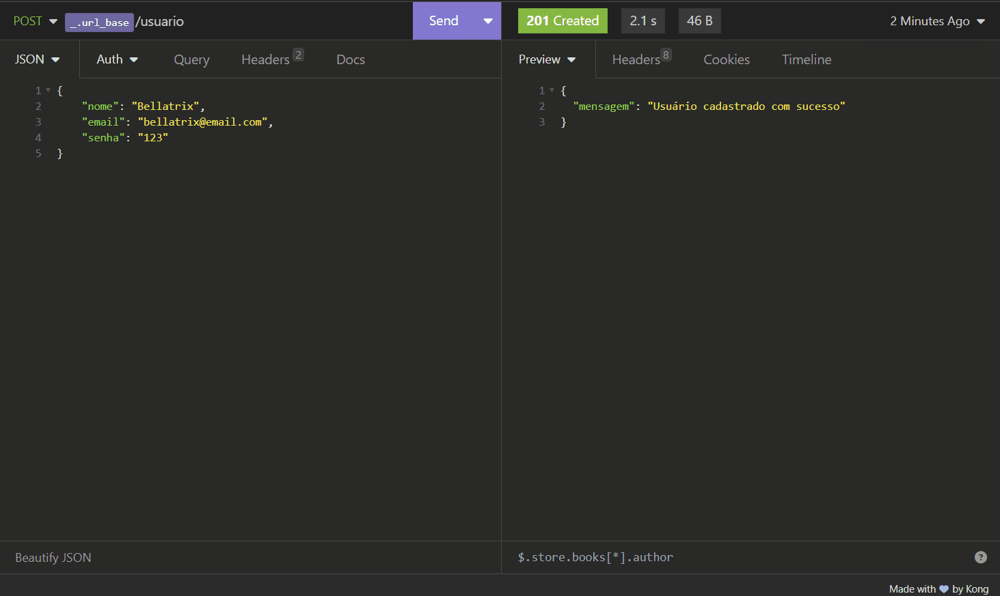

# Desafio Final - Backend


## Pré-visualização



## Descrição do Projeto

Este projeto é uma API desenvolvida na arquitetura REST, para um sistema PDV (frente de caixa). As principais tecnologias utilizadas foram JavaScript, Node.js e PostgreSQL.

## Funcionalidades

- Listar categorias
- Cadastrar Usuário
- Fazer Login
- Detalhar Perfil do Usuário Logado
- Editar Perfil do Usuário Logado
- Cadastrar Produto
- Editar Dados do Produto
- Listar Produtos
- Detalhar Produto
- Excluir Produto por ID
- Cadastrar Cliente
- Editar Dados do Cliente
- Listar Clientes
- Detalhar Cliente
- Cadastrar Pedido
- Listar Pedidos

## Pré-requisitos

Para utilizar a aplicação, certifique-se de ter os seguintes recursos instalados:

- Node.js
- PostgreSQL
- Editor SQL
- Ferramenta de teste de APIs

## Instalação

Para configurar o projeto em ambiente local, siga estas etapas:

1. Clone o repositório:

   ```bash
   git clone https://github.com/RenataUzeda/pdv-bellavenda
   ```

2. Navegue até a pasta do projeto:

   ```bash
   cd pdv-bellavenda
   ```

3. Instale as dependências:

   ```bash
   npm install
   ```

4. Execute o arquivo [`dump.sql`](dump.sql) no editor/gerenciador SQL para configurar o banco de dados.

5. Crie um arquivo `.env` na raiz do projeto com as seguintes variáveis e seus respectivos valores, como mostrado no arquivo [`.env.exemplo`](.env.exemplo):

   ```
    PORT=

    JWT_PASS=

    DB_HOST=
    DB_PORT=
    DB_USER=
    DB_PASS=
    DB_NAME=

    EMAIL_HOST=
    EMAIL_PORT=
    EMAIL_USER=
    EMAIL_PASS=
    EMAIL_FROM=

    KEY_ID=
    KEY_NAME=
    KEY_APP=

    ENDPOINT_BLACKBLAZE=
    BUCKET_NAME=

   ```

6. Inicie o servidor:

   ```
   npm run dev
   ```

## Como utilizar

Utilize o projeto com uma ferramenta de teste e depuração de APIs, como o Insomnia.

### Execução Local

Por padrão, o projeto estará rodando no localhost e utilizando a porta `3000` do servidor, definida no arquivo [`index.js`](./src/index.js).

### Deploy da API

De forma alternativa, esta API está hospedada no seguinte link e pode ser acessada: [`PDV Bellavenda`](https://pdv-bellavenda.cyclic.app/).

### Arquivo para testes de endpoints

Caso utilize o Insomnia, você pode carregar o arquivo [`Insomnia.json`](./assets/Insomnia.json) diretamente em seu ambiente para acessar as requisições pré-configuradas. Utilize a variável `_.url_local` para testar o projeto no localhost ou a variável `_.url_deploy` para testar os endpoints via deploy da API.

### Endpoints e exemplos de requisição

<details>
<summary>Listar Categorias</summary>

`GET` `/categoria`

Essa rota lista todas as categorias cadastradas na API, não é necessário estar logado para acessar.

Exemplo de requisição

```
// GET /categoria
// Sem conteúdo no corpo (body) da requisição
```

</details>

<details>
<summary>Cadastrar Usuário</summary>

`POST` `/usuario`

Permite que o usuário cadastre-se na aplicação.

Exemplo de requisição

```
// POST /usuario
{
    "nome": "Bellatrix",
    "email": "bellatrix@email.com",
    "senha": "123"
}
```

</details>

<details>
<summary>Login do Usuário</summary>

`POST` `/login`

Permite o usuario cadastrado realizar seu login no sistema.

Exemplo de requisição

```
// POST /login
{
    "email": "bellatrix@email.com",
    "senha": "123"
}
```

</details>

##### 👉 Para acessar os endpoints abaixo é necessário estar logado

<details>
<summary>Detalhar Usuário</summary>

`GET` `/usuario`

Essa rota detalha os dados do perfil do usuário que estiver logado (exceto a senha). Esta rota só é acessível mediante login.

Exemplo de requisição

```
// GET /usuario
// Sem conteúdo no corpo (body) da requisição
```

</details>

<details>
<summary>Atualizar Usuário</summary>

`PUT` `/usuario`

Essa rota identifica o ID do usuário logado através do token de autenticação e realiza alterações nos dados deste usuário.

Exemplo de requisição

```
// PUT /usuario
{
    "nome": "Bellavenda",
    "email": "bellavenda@email.com",
    "senha": "321"
}
```

</details>

<details>
<summary>Cadastrar Produto</summary>

`POST` `/produto`

Essa rota permite que o usuário logado faça o cadastro de um novo produto no sistema.

Exemplo de requisição

```
// POST /produto
{
    "descricao": "Leite integral em caixa",
    "quantidade_estoque": 42,
    "valor": 548,
    "categoria_id": 4
}

// opcionalmente, cadastre uma imagem para o produto
// utilizando o formato Multipart Form, siga o modelo:

    | Variável           | Tipo do Campo |
    |--------------------|---------------|
    | descricao          | Texto/Valor   |
    | quantidade_estoque | Texto/Valor   |
    | valor              | Texto/Valor   |
    | categoria_id       | Texto/Valor   |
    | produto_imagem     | File          |


```

</details>

<details>
<summary>Editar Produto</summary>

`PUT` `/produto/:id`

Essa rota permite que o usuário logado faça alterações em um produto existente no sistema.

Exemplo de requisição

```
// PUT /produto/1
{
    "descricao": "Leite integral em caixa",
    "quantidade_estoque": 42,
    "valor": 548,
    "categoria_id": 4
}

// opcionalmente, cadastre uma imagem para o produto
// utilizando o formato Multipart Form, siga o modelo:

    | Variável           | Tipo do Campo |
    |--------------------|---------------|
    | descricao          | Texto/Valor   |
    | quantidade_estoque | Texto/Valor   |
    | valor              | Texto/Valor   |
    | categoria_id       | Texto/Valor   |
    | produto_imagem     | File          |
```

</details>

<details>
<summary>Listar Produtos</summary>

`GET` `/produto`

Essa rota lista todos os produtos cadastrados na API. Caso seja informado o parâmetro de requisição (qery params) `categoria_id`, a resposta será uma lista com filtro de produtos que possuem aquela categoria.

Exemplo de requisição

```
// GET /produto
// Sem conteúdo no corpo (body) da requisição

// GET /produto?categoria_id=4
// Sem conteúdo no corpo (body) da requisição
```

</details>

<details>
<summary>Detalhar Produto</summary>

`GET` `/produto/:id`

Essa rota detalha os dados do produto cadastrado no sistema que corresponda ao id informado.

Exemplo de requisição

```
// GET /produto/1
// Sem conteúdo no corpo (body) da requisição
```

</details>

<details>
<summary>Excluir Produto por ID</summary>

`DELETE` `/produto/:id`

Essa rota faz a exclusão no banco de dados do produto que corresponde ao id informado na rota.

Exemplo de requisição

```
// DELETE /produto/1
// Sem conteúdo no corpo (body) da requisição
```

Ao deletar um produto, a imagem associada a ele também será deletada do serviço de hospedagem:


</details>

<details>
<summary>Cadastrar Cliente</summary>

`POST` `/cliente`

Permite que o usuário logado no sistema cadastre um novo cliente no banco de dados.

Exemplo de requisição

```
// POST /cliente

// campos obrigatórios
{
    "nome": "Bellatrix",
    "email": "bellatrix@email.com",
    "cpf": "123"
}

// campos opcionais
{
    "cep" : "00000000",
    "rua" : "X",
    "numero" : 12,
    "bairro" : "Y",
    "cidade" : "Z",
    "estado" : "UF"
}
```

</details>

<details>
<summary>Editar Dados do Cliente</summary>

`PUT` `/cliente/:id`

Permite que o usuário logado no sistema edite dados de um cliente existente no banco de dados.

Exemplo de requisição

```
// PUT /cliente/1

// campos obrigatórios
{
    "nome": "Bellatrix",
    "email": "bellatrix@email.com",
    "cpf": "123"
}

// campos opcionais
{
    "cep" : "00000000",
    "rua" : "X",
    "numero" : 12,
    "bairro" : "Y",
    "cidade" : "Z",
    "estado" : "UF"
}
```

</details>

<details>
<summary>Listar Clientes</summary>

`GET` `/cliente`

Essa rota lista todos os clientes cadastrados na API.

Exemplo de requisição

```
// GET /cliente
// Sem conteúdo no corpo (body) da requisição
```

</details>

<details>
<summary>Detalhar Cliente</summary>

`GET` `/cliente/:id`

Essa rota detalha os dados do cliente cadastrado no sistema que corresponda ao id informado.

Exemplo de requisição

```
// GET /cliente/1
// Sem conteúdo no corpo (body) da requisição
```

</details>

<details>
<summary>Cadastrar Pedido</summary>

`PUT` `/pedido`

Permite que o usuário logado no sistema cadastre um novo pedido no banco de dados.

Exemplo de requisição

```
// PUT /pedido
{
    "cliente_id": 1,
    "observacao": "Em caso de ausência recomendo deixar com algum vizinho",
    "pedido_produtos": [
        {
            "produto_id": 1,
            "quantidade_produto": 10
        },
        {
            "produto_id": 2,
            "quantidade_produto": 20
        }
    ]
}
```

Ao cadastrar um novo pedido, uma mensagem de confirmação será enviada para o cliente por e-mail.


</details>

<details>
<summary>Listar Pedidos</summary>

`GET` `/pedido`

Essa rota lista todos os pedidos cadastrados na API.

Exemplo de requisição

```
// GET /pedido
// Sem conteúdo no corpo (body) da requisição
```

</details>

## Contribuidoras

- [daphnevilhar](https://github.com/daphnevilhar)
- [marina-barbosa](https://github.com/marina-barbosa)
- [marriett](https://github.com/marriett)
- [RenataUzeda](https://github.com/RenataUzeda)
- [sara-t-g-silva](https://github.com/sara-t-g-silva)

---

Este projeto foi desenvolvido como Desafio Final do curso de Backend da [Cubos Academy](https://cubos.academy/).
